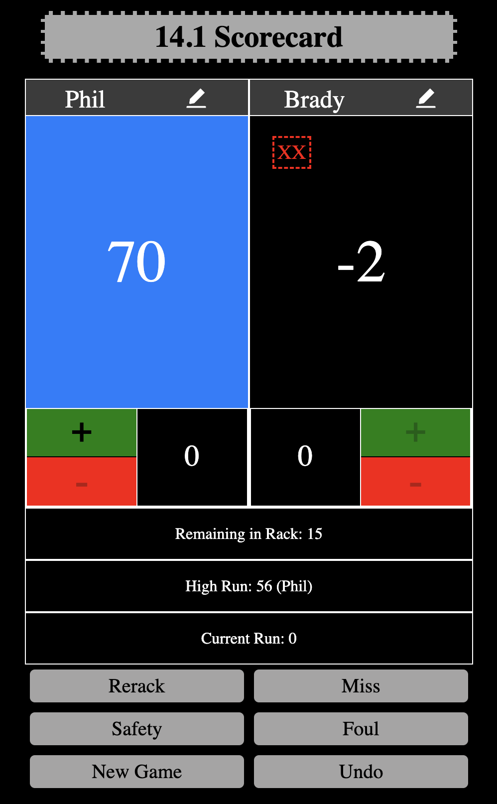

# 14.1 Scorecard 

## Description
    
This is a simple application designed to keep score for 14.1/straight pool. If you find yourself playing on a table without any way to keep score, fire up this nifty app!
    
## Installation
    
No installation necessary, simply navigate to https://straight-pool-counter-mms5766hz-moviefan322.vercel.app/

## Usage
    
The layout is fairly intuitive, you can customize player names, and simply keep track of the balls as you go    
 
## Testing

Functionally, play a game and follow along, or download the repo and run the test suite

## Contributors
    
Just I

## License
    
This is a simple application designed to keep score for 14.1/straight pool. If you find yourself playing on a table without any way to keep score, fire up this nifty app!

## Questions

Philip Neumann

https://github.com/moviefan322

philman202@yahoo.com
    